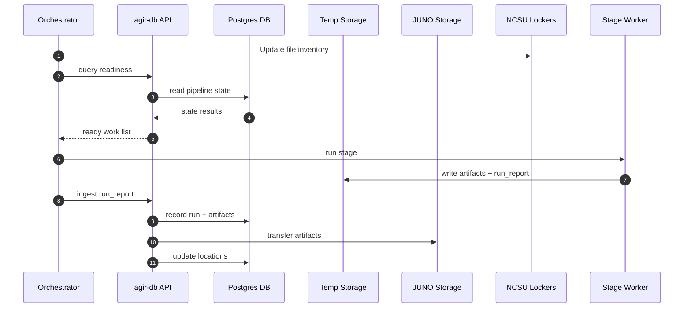
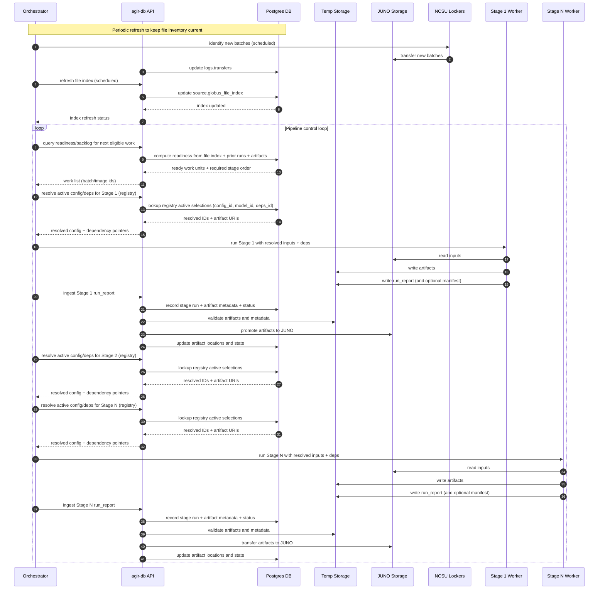

## High-Level Design Overview

### Terms
1. **Batch** - group of images processed together, usually by a collection event and location (`MD_2025-01-01`)
2. **Stage worker** - image processing stage (`raw_to_jpg`, `jpg_to_det`, `meta_to_cutout`, `cutout_props`, etc.)
3. **Artifacts** - processing data products (processed jpgs, bounding box detections, segmentaion masks, etc.)
4. **`run_report`** - required json file summary creted by every stage that describes execution details like status, counts, provenance (config/model/deps), and output locations. They are an important primary ingestion contract for each stage.

### Simplified

### Detailed

